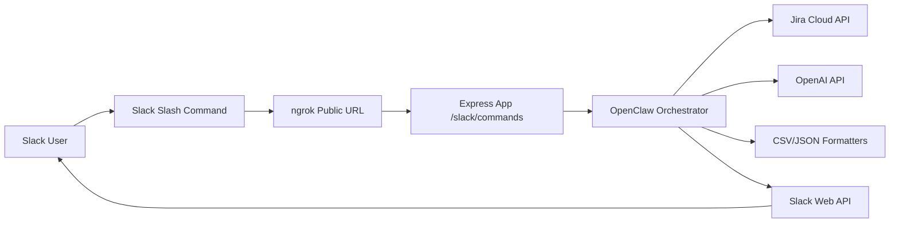
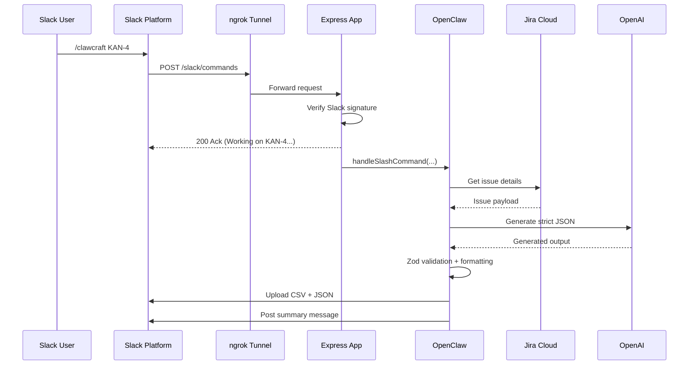

# pt-claw: End-to-End Project Guide

## 1) Project in One Minute

`pt-claw` is an educational QA automation pipeline.
A user runs a Slack slash command like:

```text
/clawcraft KAN-4
```

The system then:
1. Fetches Jira issue `KAN-4`.
2. Uses **OpenClaw** (internal orchestration module) to coordinate generation.
3. Calls ChatGPT via OpenAI API to generate test scenarios.
4. Validates the AI response with Zod.
5. Produces Xray-ready placeholder files:
   - `KAN-4_xray_tests.csv`
   - `KAN-4_xray_tests.json`
6. Uploads those files back to Slack.

If user runs:

```text
/clawcraft KAN-4 generate script
```

and the Jira issue is a **Bug** with clear STR, it can also generate automation code (Playwright/Appium path).

---

## 2) Key Components (What each part does)

### Slack (User Interface)
- Entry point for users.
- Receives `/clawcraft` command.
- Gets quick acknowledgement within 3 seconds.
- Receives final results (summary + files).

### ngrok (Public Bridge)
- Exposes your local app (`localhost:3000`) to the internet.
- Gives a temporary public URL used in Slack slash command config.
- Without ngrok, Slack cannot call your local machine.

### Express Server (HTTP Host)
- Hosts endpoint: `POST /slack/commands`.
- Verifies Slack signature for security.
- Starts asynchronous background processing.

### Jira Service
- Fetches issue from Jira Cloud REST API v3.
- Extracts issue details: type, summary, description, STR, expected/actual, environment.

### OpenClaw (Orchestration Layer)
- Core coordinator of business workflow.
- Builds prompts, calls OpenAI, validates response, formats files, sends to Slack.
- Implemented internally now, designed to be extracted later as a standalone service.

### OpenAI Service
- Sends prompt to ChatGPT model.
- Runs one repair call if JSON is invalid.

### Zod Schemas
- Enforces strict output contract.
- Prevents malformed AI output from propagating downstream.

### Formatters
- Converts validated scenarios into:
  - placeholder Xray CSV shape
  - JSON import payload shape

---

## 3) Why this architecture is useful (Advantages)

1. **Fast team workflow**
   - QA assets generated directly from Jira by simple Slack command.

2. **Safer AI integration**
   - Strict schema validation and repair attempt reduce bad outputs.

3. **Clear separation of concerns**
   - `services/` for integrations, `openclaw/` for orchestration logic.

4. **Extensible design**
   - OpenClaw module can later become a separate microservice with minimal refactor.

5. **Demo-friendly and production-minded**
   - Immediate Slack ack, correlation IDs, signature verification, structured error handling.

---

## 4) Underlying Architecture (Visual)

## Picture 1: High-level component map



## Picture 2: Request lifecycle



## Picture 3: Simple local-dev networking view

```text
Slack Cloud ---> https://abc123.ngrok-free.dev/slack/commands ---> localhost:3000 (your laptop)
```

---

## 5) Where OpenClaw exists in this repo

- `src/openclaw/orchestrator.ts`
  - Main control flow.
- `src/openclaw/prompt.ts`
  - Prompt construction using Jira data + command flags.
- `src/openclaw/schema.ts`
  - Strict Zod schema for AI output.
- `src/openclaw/formatters.ts`
  - Xray placeholder CSV/JSON payload creation.

OpenClaw is instantiated in:
- `src/index.ts`

OpenClaw is invoked from:
- `src/routes/slackCommands.ts`

---

## 6) How ngrok is used exactly

1. Start app:

```bash
npm run dev
```

2. Start tunnel:

```bash
ngrok http 3000
```

3. Copy forwarding URL (example):

```text
https://unprohibited-tenley-scrawnily.ngrok-free.dev
```

4. Set Slack slash command Request URL:

```text
https://unprohibited-tenley-scrawnily.ngrok-free.dev/slack/commands
```

5. Keep ngrok running while testing.

> Important: if ngrok restarts, URL may change; update Slack Request URL again.

---

## 7) End-to-End Setup Steps

1. Fill `.env` values.
2. Run `npm run dev`.
3. Run `ngrok http 3000`.
4. Configure Slack app:
   - command: `/clawcraft`
   - scopes: `commands`, `chat:write`, `files:write`
   - request URL: `<ngrok>/slack/commands`
5. Reinstall Slack app after scope/command changes.
6. Invite bot to channel (if needed):
   - `/invite @<bot-name>`

---

## 8) Sample Jira Inputs

## Sample A: User Story (manual tests path)

- Issue Type: `Story`
- Summary: `As a shopper, I can save multiple shipping addresses at checkout`
- Description:

```text
As a shopper,
I want to save multiple shipping addresses,
so that I can quickly choose one during checkout.

Acceptance Criteria:
1. User can add a new shipping address from checkout.
2. User can edit or delete a saved address.
3. User can mark one address as default.
4. Default address is preselected.
5. Required field validation is shown.

Environment:
Web app, Chrome latest, Windows 11
```

Run:

```text
/clawcraft KAN-5
```

Expected:
- CSV + JSON generated and uploaded.
- No mandatory automation script path.

## Sample B: Bug (manual + automation path)

- Issue Type: `Bug`
- Summary: `Login fails with valid credentials on Chrome`
- Description:

```text
Steps to Reproduce:
1. Open https://example-app.test/login
2. Enter valid username and password
3. Click Login

Expected Result:
User should land on dashboard.

Actual Result:
Error toast appears and user remains on login page.

Environment:
Chrome 122, Windows 11
```

Run:

```text
/clawcraft KAN-4
/clawcraft KAN-4 generate script
```

Expected:
- Both commands generate CSV + JSON.
- `generate script` includes automation if bug + clear STR conditions are satisfied.

---

## 9) Common Issues and Fixes

- **`dispatch_failed`**
  - Usually request URL/path mismatch, endpoint down, or signature issues.

- **`Invalid Slack signature`**
  - `SLACK_SIGNING_SECRET` mismatch. Re-copy from Slack Basic Information and restart app.

- **`not_in_channel`**
  - Bot not in channel. Invite bot or rely on auto-join for supported public channels.

- **Ack appears but no final files**
  - Check server logs by correlation id for Jira/OpenAI/Slack failures.

---

## 10) Current Limitations (MVP scope)

- CSV is a placeholder schema (official Xray template swap pending).
- No database/history persistence.
- Threaded reply behavior can be improved further.
- STR and AC extraction uses heuristic parsing (good for MVP, can be hardened).

---

## 11) Suggested Next Improvements

1. Add unit tests for Jira parsing and formatter logic.
2. Add idempotency and retry policy for Slack/OpenAI calls.
3. Add observability (structured logs, metrics).
4. Introduce official Xray CSV field mapping and import validation.
5. Extract OpenClaw into standalone service when scaling.

---

## 12) Quick Command Reference

```text
/clawcraft <JIRA_KEY>
/clawcraft <JIRA_KEY> generate script
```

Examples:

```text
/clawcraft KAN-4
/clawcraft KAN-4 generate script
/clawcraft KAN-5
```

---

## Quick-Summary

`pt-claw` is a Slack-driven QA generator that turns Jira issues into Xray-ready test artifacts.

- User triggers workflow using `/clawcraft <JIRA_KEY> [generate script]`.
- Slack request reaches local Express app through ngrok.
- OpenClaw orchestrator fetches Jira details, builds AI prompt, validates strict JSON, and formats outputs.
- System uploads CSV/JSON files back to Slack and posts a concise summary.
- For Bug issues with clear STR and `generate script`, automation code can be included (Playwright/Appium path).

In one line: **Slack starts it, ngrok connects it, OpenClaw coordinates it, Jira informs it, and OpenAI generates it.**
